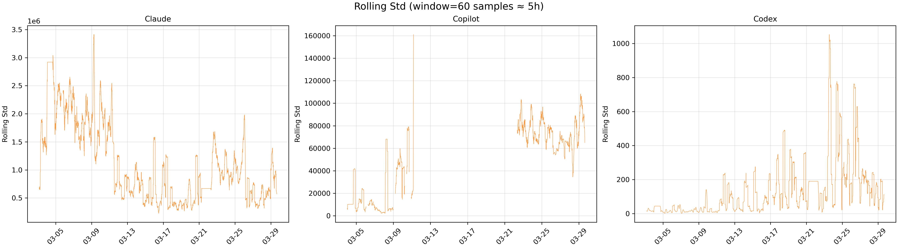
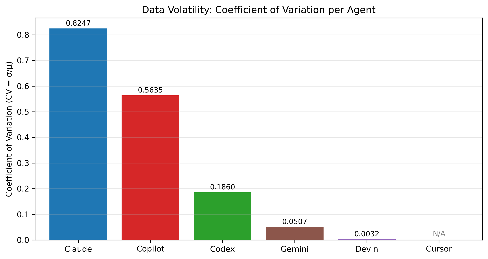
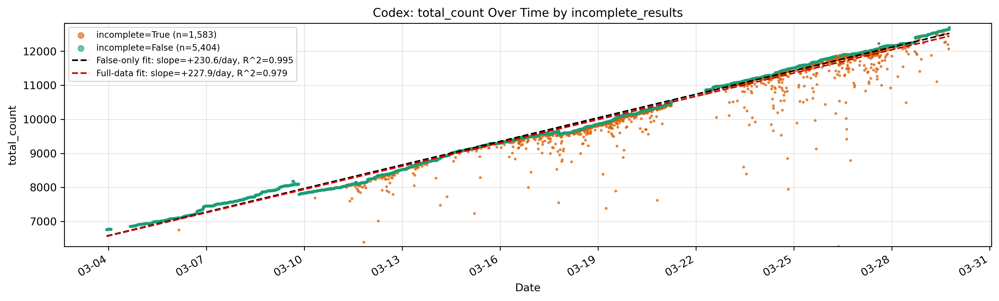
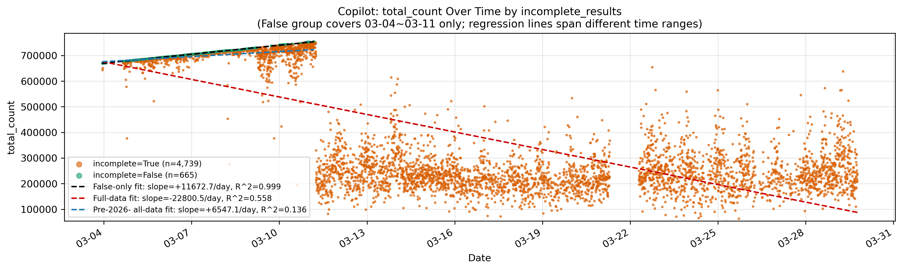

The [agent-commits](https://github.com/ASSERT-KTH/agent-commits) repository tracks six AI coding agents (Claude, Copilot, Codex, Gemini, Devin, Cursor) by sampling GitHub Search Commits API every 5 minutes and recording `total_count` over 27 days (2026-03-03 to 2026-03-29). This report investigates whether the collected `total_count` time-series data is reliable, and whether the API-provided `incomplete_results` field can serve as a data quality indicator. Analysis code, figures, and the identity audit (Appendix A) are available at [tsukii7/ai-agent-commit-data-quality](https://github.com/tsukii7/ai-agent-commit-data-quality).

## 1. Volatility of `total_count` Across Agents

#### Analysis Method

- Descriptive statistics (mean, std, min, max, CV = std/mean) computed per agent to quantify absolute and normalized volatility
- Rolling standard deviation (window = 60 samples ≈ 5 hours) to detect temporal variation in volatility
- Cross-agent CV bar chart for normalized comparison across agents with different orders of magnitude
- Gemini, Devin, and Cursor excluded from time-series plots: Gemini/Devin are near-constant with ~86% `NaN` coverage; Cursor is always 0

#### Steps

1. Load 6 enriched CSVs (original CSVs augmented with `incomplete_results` via timestamp-matched JSON); count valid (non-`NaN`) rows per agent
2. Compute descriptive statistics for all agents (see @tbl-1)
3. Plot `total_count` time series for Claude, Copilot, Codex (see @fig-1)
4. Compute rolling std (window = 60), plot for Claude, Copilot, Codex (see @fig-2)
5. Plot CV bar chart for all 6 agents, annotating Cursor as N/A (see @fig-3)

#### Analysis Results

Per-agent descriptive statistics (see @tbl-1):

- **Claude** (CV = 0.82): `total_count` swings between 767K and 15.2M, a 20× spread that makes raw values effectively unusable.
- **Copilot** (CV = 0.56): Maintains a high plateau of ~600K–700K before 2026-03-11, then collapses to a 100K–400K range.
- **Codex** (CV = 0.19): Grows steadily from 5.6K to 12.7K; intermittent low-estimate spikes become more frequent in the later collection period.
- **Gemini, Devin, Cursor**: Negligible volatility, but data is sparse or structurally absent, precluding meaningful time-series analysis.

Rolling std (see @fig-2) reveals further temporal structure:

- **Claude**: Volatility is temporally concentrated, with a peak rolling std of ~3.41M during 03-05 to 03-09, moderating thereafter.
- **Copilot**: Rolling std has a gap from 03-13 to 03-21 due to `NaN` density reaching 12%–48% per day, causing the rolling window's non-`NaN` requirement to fail.

## 2. Impact of `incomplete_results` on Data Quality

#### Analysis Method

- True/False proportion statistics for Claude, Copilot, Codex to establish baseline (see @tbl-2)
- Box plot (Copilot + Codex only): Claude's False group contains only 5 samples, insufficient for distributional comparison
- Grouped CV comparison (full vs. False-only) for Copilot and Codex; Claude treated descriptively
- Time-series scatter with dual regression lines (False-only + full-period) for Codex (@fig-5) and Copilot (@fig-6), to quantify how filtering changes the inferred trend
- Daily `incomplete=True` ratio panel (@fig-7, 3×1) to observe temporal evolution across agents

#### Steps

1. Load enriched CSVs for Claude, Copilot, Codex; drop rows where `incomplete` is `NaN`; verify True/False counts (@tbl-2)
2. Plot box plot @fig-4 (Copilot + Codex, 1×2 layout), annotating group sizes
3. Compute full vs. False-only CV for Copilot and Codex; report Claude descriptively
4. Plot Codex scatter @fig-5: True/False color-coded, False-only regression (black dashed) + full regression (red dashed)
5. Plot Copilot scatter @fig-6: same structure plus pre-03-12 full regression (blue dashed)
6. Compile regression summary @tbl-3
7. Plot daily True ratio panel @fig-7 (left axis: True ratio; right axis: daily sample count)

#### Analysis Results

True% is monotonically ordered by query result-set scale (Claude millions > Copilot hundreds of thousands > Codex thousands), with saturation times staggered accordingly: Claude reaches 100% True by 2026-03-05, Copilot by 03-12, and Codex never exceeds 62% by 03-29. This staggered, non-synchronous pattern rules out global API load as the primary driver; see Section 3.2 for full hypothesis analysis.

The box plots (@fig-4) show a clear contrast between agents:

- **Copilot**: True and False groups are near-non-overlapping (True Q3 = 655K vs. False Q1 = 692K; medians 262K vs. 707K), establishing that API timeout systematically suppresses returned counts.
- **Codex**: Two groups are highly overlapping (True median = 10.1K vs. False median = 9.1K), indicating that `incomplete=True` does not reliably signal underestimation for small result sets. The counter-intuitive direction of the medians is explained by temporal mixing (see Section 3.1).

Regression results (@tbl-3) sharpen this contrast:

- **Codex** (@fig-5): Full-period and False-only slopes differ by only −1.2% and are visually indistinguishable. `incomplete=True` generates isolated low-estimate spikes (all six post-03-10 values below 7K are True (necessary but not sufficient)), while the majority of True samples remain within the normal trend band. Codex's growth trend is robust to filtering.
- **Copilot** (@fig-6): Full-period slope (−22,800.5/day) and False-only slope (+11,672.7/day) are opposite in sign: the full dataset implies a declining trend while the reliable subset implies growth. Three lines of evidence point to the same cause: (1) near-non-overlapping box plot distributions; (2) sign reversal in regression slopes; (3) True ratio reaching 100% at 03-12, coinciding with the `total_count` crash in @fig-1. The only usable subset is the False group (n = 665, 8 days, 03-04–03-11); even here, the pre-03-12 full regression (slope = +6,547.1/day, R² = 0.136) shows near-zero fit quality, confirming True-group distortion predates complete API degradation.

## 3. Discussion

#### 3.1 Temporal Mixing Confounds Cross-Group Comparison (Codex)

The Codex True group median (10.1K) exceeds the False group median (9.1K) in @fig-4, which appears to contradict the expectation that `incomplete=True` implies underestimation. The explanation is temporal mixing: the False group contains a large share of early-period samples (03-03–03-10) when `total_count` was only ~6.8K–8K, pulling its median down, while the True group is concentrated in the later period (03-11 onward) when the baseline had already risen to ~10K–12K. The True group's higher median therefore reflects temporal position, not any benefit from `incomplete=True`. Residual underestimation evidence survives in the True group's lower whisker (6.2K vs. 6.8K for False) and three outliers (min = 5,646). In trending data, cross-group median comparison conflates temporal position with signal; the correct approach is within-period deviation from the contemporaneous trend, as in @fig-5.

#### 3.2 Root Cause of `incomplete_results=True`: Multi-Layer Evidence

Three hypotheses were tested against the 27-day dataset:

**(A) Query scale:** Result sets exceeding the API's internal timeout threshold trigger `incomplete=True`. Supported by monotonic True%–magnitude ordering across agents and staggered saturation times inconsistent with synchronous global-load effects.

**(B) Global server load:** Server load spikes affect all agents simultaneously. Rejected: if true, all three agents' True ratios would rise synchronously. @fig-7 shows the opposite: staggered saturation ordered by result-set scale.

**(C) Dynamic growth:** Growing result sets over time gradually approach the threshold, pushing True ratio upward. Supported — Codex provides direct evidence (False-only growth slope +230.6/day temporally aligned with True ratio rise from ~0 to 9%–62% as `total_count` crosses ~9K–10K); Copilot provides indirect evidence (False-only slope +11,672.7/day during 03-04–03-11, consistent with result set approaching saturation by 03-12).

Claude is an edge case: at ~14.7M results, all 5 False samples fall within a 2.5-hour window (03-03 22:50–03-04 01:08, range = 20K), showing that at extreme scale, query size (A) makes timeout near-certain while server load only determines when the rare False event occurs. **Conclusion:** (A) is the primary driver; (C) progressively raises True ratio over time; (B) is not a primary factor.

#### 3.3 Filter Effectiveness Inversely Scales with Query Size

Copilot's False-only CV = 0.027 vs. full CV = 0.564 (−95.3%) appears highly effective, but False samples exist only in the early, lower-variance period (03-04–03-11). After filtering, the post-03-11 period has zero usable data; the apparent quality gain is an artifact of temporal confound, and filtering worsens the situation by eliminating the only evidence of Copilot's later behavior. Codex's False-only CV = 0.187 vs. full CV = 0.179 (+4.7%): filtering provides no benefit, and the effective strategy is to use all samples for trend estimation while treating individual True-group low-spikes with local caution. General principle: the larger the query result set relative to the API timeout threshold, the more the False group shrinks to an early unrepresentative window, making filtering appear more effective while becoming less informative.

## 4. Conclusion

- **Volatility:** All three actively-tracked agents return highly unreliable `total_count` values (CV: Claude 0.82, Copilot 0.56, Codex 0.19); Claude's data is effectively unusable in raw form, and Copilot exhibits a structural break post-03-11.
- **Scale drives `incomplete=True`:** The API timeout rate is governed by query result-set scale rather than global server load, as confirmed by monotonic True% ordering and staggered (not synchronous) saturation times across agents.
- **Filtering has no universal benefit:** Filtering on `incomplete=False` reduces Codex's trend distortion to near-zero (slope change −1.2%) but cannot help Copilot, where the False group covers only 8 early days and vanishes entirely after 03-11.
- **Copilot data is structurally compromised:** The full-period trend direction is inverted relative to the reliable subset; only the 03-04 to 03-11 False group (n = 665) is usable, and it is insufficient to characterize global growth.

Due to scope constraints, this study analyzed only the CSV-level `total_count` time series; the 19,000+ JSON snapshots containing commit-level metadata were not examined. Three further limitations apply: (1) the GitHub Search API is inherently approximate: `total_count` can be non-monotone even under `incomplete=False`, and fork repositories inflate counts; (2) the 27-day window is insufficient to characterize long-term trajectories, particularly for agents whose usable window is compressed by API degradation; (3) as detailed in Appendix A, two agents (Devin, Cursor) are structurally unobserved due to incorrect search emails, and all agents are underrepresented because single-email queries miss the multi-identity architecture of modern AI coding tools.

Future work should address these limitations on multiple fronts. On collection design: adopt corrected identity sets (validated bot noreply emails plus co-author channels) and report author-mode and co-author-mode commits separately. On API reliability: query commits within rolling time windows and aggregate window-level counts (as in [github-coding-agent-tracker](https://github.com/powerset-co/github-coding-agent-tracker)) to keep each query's result set small enough to avoid timeouts. On depth of analysis: commit-level JSON data could support further investigation into temporal frequency (time-of-day and day-of-week patterns), repository concentration (whether a few repositories dominate agent commit volume), and programming language distribution across agent-authored commits.



## Appendix A: Commit Identity Audit

A supplementary audit of agent identity coverage is documented in full at [tsukii7/ai-agent-commit-data-quality](https://github.com/tsukii7/ai-agent-commit-data-quality) (`docs/exploratory-commit-identity-audit.md`). The audit evaluates the `collect-data.sh` search design against validated identities retrieved via the GitHub REST API (`GET /user/{id}`) as of 2026-03-27 and identifies two structural problems.

**Problem 1: Wrong or ineffective search emails.** Two agents' search emails return no meaningful results: Cursor's configured email (`cursor@anysphere.io`) returns 0 commits, while the correct agent author email (`cursoragent@cursor.com`) returns ~400K. Devin's configured email (`devin@cognition.ai`) is similarly unused in practice; the validated bot identity (`158243242+devin-ai-integration[bot]@users.noreply.github.com`) returns 168K. The near-zero counts for these two agents therefore reflect a collection design failure, not low agent activity.

**Problem 2: Single-identity queries miss multi-identity architecture.** Each agent maintains multiple parallel GitHub identities: a GitHub App bot (cloud/autonomous mode), optionally a user account (CLI mode), custom author emails, and co-authored-by trailer emails. The script captures at most one identity per agent. For example, Copilot's configured co-author email captures ~950K commits, while the bot author identity (`198982749+Copilot@users.noreply.github.com`) accounts for an additional 2.9M autonomous SWE-agent commits. Claude's CLI author channel captures 3.3M commits, but the full-text co-author signal covers ~11.6M. These are semantically distinct: agent-as-author (fully autonomous) versus agent-as-co-author (human-led with AI assistance), and should be reported separately in future collection designs. The full audit covers identity verification methodology, author-mode versus co-author-mode taxonomy, per-agent search evidence, and a corrected query table with expanded identity coverage for all six agents.



## Appendix B: Figures and Tables

: Descriptive statistics per agent. CV = std/mean; N/A indicates mean = 0. {#tbl-1}

| Agent   | Valid  | Mean      | Std       | Min     | Max        | CV     |
|---------|--------|-----------|-----------|---------|------------|--------|
| Claude  | 7,243  | 5,034,170 | 4,151,755 | 767,372 | 15,176,548 | 0.8247 |
| Copilot | 5,408  | 406,884   | 229,259   | 36,855  | 754,968    | 0.5635 |
| Codex   | 7,243  | 9,423     | 1,753     | 5,646   | 12,701     | 0.1860 |
| Gemini  | 674    | 60        | 3         | 58      | 107        | 0.0507 |
| Devin   | 670    | 12        | 0.04      | 12      | 13         | 0.0032 |
| Cursor  | 670    | 0         | 0         | 0       | 0          | N/A    |

: `incomplete=True` proportions (rows with `NaN` excluded). {#tbl-2}

| Agent   | True  | False | True%  |
|---------|-------|-------|--------|
| Claude  | 6,982 | 5     | 99.9%  |
| Copilot | 4,739 | 665   | 87.7%  |
| Codex   | 1,583 | 5,404 | 22.7%  |

: Regression summary. Copilot pre-03-12 full slope = +6,547.1/day, R² = 0.136. {#tbl-3}

| Agent   | Full Slope (/day) | Full R² | False-only Slope (/day) | False-only R² |
|---------|-------------------|---------|--------------------------|---------------|
| Codex   | +227.9            | 0.979   | +230.6                   | 0.995         |
| Copilot | −22,800.5         | 0.558   | +11,672.7                | 0.999         |

{#fig-1 width=100%}

{#fig-2 width=100%}

{#fig-3 width=70%}

{#fig-4 width=100%}

{#fig-5 width=100%}

{#fig-6 width=100%}

{#fig-7 width=100%}
